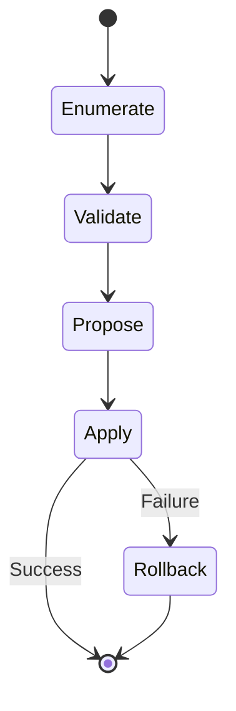
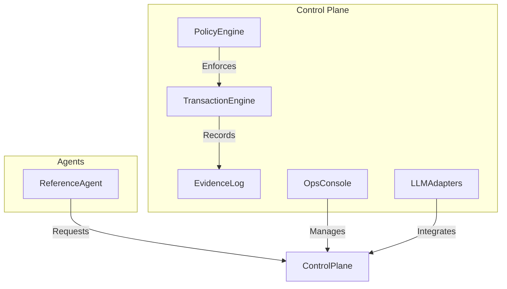

# 2026-01-08 Update

## Recent Changes

- Added robust Jest/Testing Library tests for RecentLogsTable and RecentTransactionsTable components.
- Improved UI error handling and search/filter reliability.
- All UI tests now pass, confirming coverage for search/filter and error handling.
- See DEVELOPMENT_LOG.md for detailed changelog.

# Transactional AI Control Plane & Governance Layer

## 1. Executive Summary

The Transactional AI Control Plane & Governance Layer is a production-grade runtime for AI agents operating in high-risk, real-world systems. It ensures that all agent actions are deterministic, transactional, policy-governed, and fully auditable. The system prevents partial, irreversible, silent, or non-reproducible failures by enforcing strict transactional boundaries, compensating actions (Saga pattern), and hard policy enforcement. It is designed for SREs, platform engineers, compliance/security teams, and AI/ML platform owners who require robust, safe, and compliant AI automation.

**Differentiators:**
- Deterministic, transactional execution (no partial or silent failures)
- Policy-first: agents cannot bypass enforcement
- Multi-provider LLM integration (OpenAI, Anthropic, Gemini)
- Audit-grade evidence and replayability
- Built-in compensating actions (Saga pattern)
- Open-source core with enterprise/SaaS extensions

**Benefits:**
- Prevents non-reproducible or unsafe agent actions
- Enables compliance, audit, and incident response
- Supports safe adoption of AI in regulated/high-risk environments

---

## 2. Core Principles

- **Transactions > Scripts:** All agent actions are grouped into atomic, reversible transactions. Example: An agent updating IAM policies must be able to roll back all changes if any step fails.
- **Policy > Autonomy:** Agents operate within strict, enforced policies. Example: An agent cannot escalate privileges or access forbidden resources, regardless of LLM output.
- **Evidence > Logs:** Every action produces cryptographically signed evidence, not just logs. Example: Each step in a workflow is recorded with before/after state, policy checks, and signatures.

---

## 3. Key Capabilities

| Capability                  | Description                                                                 | Implementation Suggestions/Examples                  |
|-----------------------------|-----------------------------------------------------------------------------|------------------------------------------------------|
| Transactional Execution     | All workflows are atomic, with compensating actions for rollback (Saga)      | State machine, explicit rollback handlers            |
| Policy-Governed Runtime     | Policy engine enforces rules before/after every action                       | OPA/Rego, custom DSL, or embedded policy engine      |
| Determinism & Replayability | All executions are deterministic and replayable from evidence                | Event sourcing, state snapshots, replay CLI          |
| Validation                  | Pre/post validation of all actions and state                                 | Schema validation, dry-run, invariants               |
| Global Safety Controls      | Immediate halt/kill switch, incident triggers, credential isolation          | Ops Console, kill switch API, identity vault         |
| Multi-Provider Resilience   | Integrate with multiple LLMs, failover, provider policy enforcement          | Adapter pattern, provider health checks              |

---

## 4. Goals & Success Criteria

- **Invariants:** No partial/irreversible/silent/non-reproducible failures
- **Transactional Integrity:** All-or-nothing execution, compensating actions for rollback
- **Audit-Grade Evidence:** Every action is signed, timestamped, and replayable
---
## 5. Reference Implementation Agent

  3. Propose changes (with dry-run)
  4. Apply changes transactionally
  5. Rollback on failure
- **Validation:** All changes must pass policy checks before commit
- **Rollback:** If any step fails, revert all changes using compensating actions
- **Diagram:**

---

## 6. Acceptance Criteria

- Atomic execution: all-or-nothing
- Hard policy enforcement: no bypass
- Immediate halt/kill switch
- Deterministic replay from evidence
- Identity isolation for all agent actions
- Validation and rollback for every workflow

---

## 7. Strategic Non-Goals

- Not a general-purpose workflow engine
- Not a replacement for cloud-native policy engines (e.g., OPA)
- Does not allow agents to self-modify policies or runtime
- No support for non-transactional, best-effort, or probabilistic actions

---

## 8. Technical Architecture & Implementation Plan

### Architecture Diagram

### Components
- **Execution Substrate:** State machine with explicit rollback handlers
- **Policy Engine:** OPA/Rego or custom DSL for policy checks
- **LLM Provider Integration:** Adapter pattern for OpenAI, Anthropic, Gemini
- **Logging/Replay:** Event sourcing, signed evidence, replay CLI
- **Kill Switch:** Immediate halt via Ops Console/API
- **Ops Console:** Web/CLI for monitoring, incident response, and policy management
- **Reference Agent:** IAM Policy Auditor as MVP

### Implementation Plan (MVP/MVA)
1. State machine execution engine with rollback
2. Policy engine integration
3. Evidence log and replay CLI
4. LLM provider adapters
5. Ops Console (CLI, then web)
6. Reference agent (IAM Policy Auditor)
7. Stress test suite
8. Enterprise features (see below)

---

## 9. Open Source & Monetization Strategy

| Feature                | OSS Core | Enterprise/SaaS |
|------------------------|----------|-----------------|
| Transactional Engine   | Yes      | Yes             |
| Policy Engine          | Yes      | Yes             |
| Multi-LLM Integration  | Yes      | Yes             |
| Ops Console (CLI)      | Yes      | Yes             |
| Ops Console (Web)      | No       | Yes             |
| Advanced Audit/Replay  | No       | Yes             |
| SSO/Identity Vault     | No       | Yes             |
| Incident Response API  | No       | Yes             |
| Enterprise Support     | No       | Yes             |

**Adoption Plan:**
- Launch OSS core on GitHub with reference agent and CLI console
- Provide SaaS/enterprise add-ons (web console, SSO, advanced audit, support)
- Target SRE, compliance, and platform engineering communities

---

## 10. Next Steps / Roadmap

1. State machine execution engine
2. Policy engine integration
3. Evidence log and replay CLI
4. LLM provider adapters
5. Ops Console (CLI, then web)
6. Reference agent (IAM Policy Auditor)
7. Stress test suite
8. Enterprise features rollout

---

## 11. Deliverables

- Architecture diagrams (see above)
- State machine and workflow diagrams
- Reference agent workflow (IAM Policy Auditor)
- Capabilities table (see above)
- OSS vs Enterprise feature table
- Step-by-step implementation plan
- Stress test suite and expected results
- MVP/MVA definition

---

**End of Blueprint**
